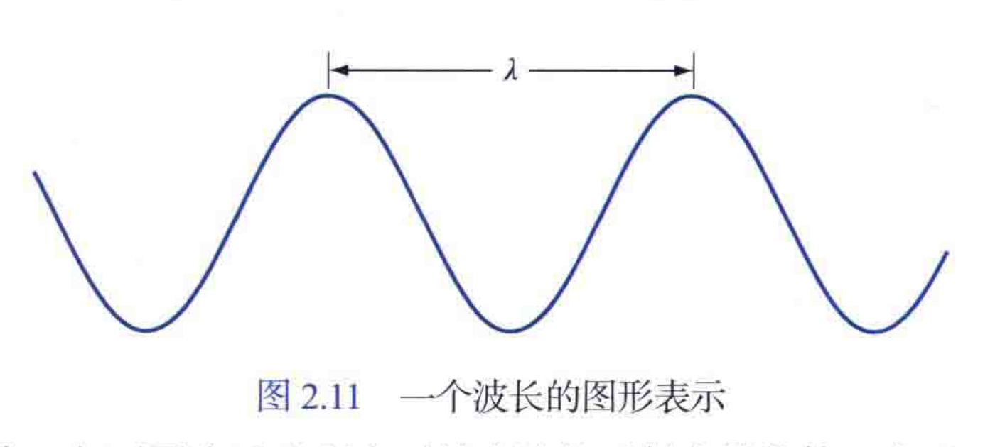

电磁波可视为以波长为λ传播的正弦波，或视为没有质量的粒子流，每个粒子像波浪一样行进并以光速运动。

感知的物体颜色由物体反射的光的性质决定。

没有颜色的光称为单色光或无色光。单色光的唯一属性是其亮度。因为单色光的感知亮度从黑色到灰色最后到白色变化，因此常用灰度级一词来表示单色光的亮度。单色光从黑到白的数值范围称为灰度级，单色图像常称为灰度图像。

#### 描述彩色光源的量：频率、辐射、光通量、亮度

频率：光波震动的频率（HZ赫兹）

辐射：从光源流出的总能量（瓦特W）

光通量：观察者从光源感知的能量（流明lm）

亮度：光感知的主观描绘子，实际不可度量，体现的是强度的无色概念，是描述色彩感觉的关键因素之一。

