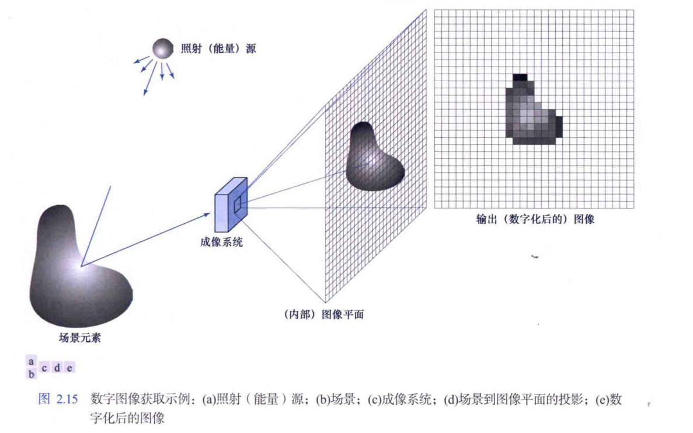

我们感兴趣的大多数图像，都是由“照射”源和形成图像的“场景”元素对光能的反射或吸收产生的。

将照射能量转换成数字图像的原理：组合输入电能和传感器对正被检测能量类型的响应，将入射能量转换为电压。输出电压波形是传感器的响应，将传感器响应数字化，得到一个数字量。

---

## 一个简单的成像模型

我们用$f(x,y)$的二维函数来表示图像。在空间坐标$(x,y)$处$f$的值是一个标量，其物理意义由图像源决定，其值与物理源辐射的能量成正比。
$$0≤f(x,y)<\infty$$
函数$f(x,y)$由两个分量来表征：

入射分量$i(x,y)$：入射到被观察场景的光源照射量

反射分量$r(x,y)$：被场景中物体反射的照射量

$$f(x,y)=i(x,y)r(x,y)$$
其中：
$$0≤i(x,y)<\infty$$
$$0≤r(x,y)<1$$
$i(x,y)$的性质取决于照射源，$r(x,y)$的性质取决于被成像物体的特性。投射成像与之同理。

