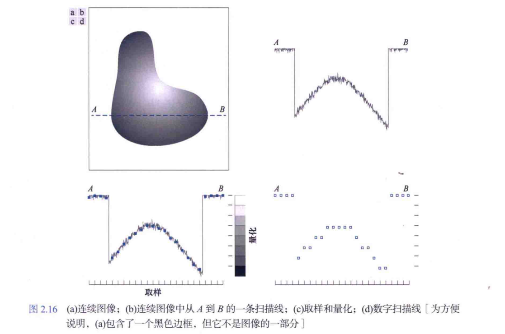
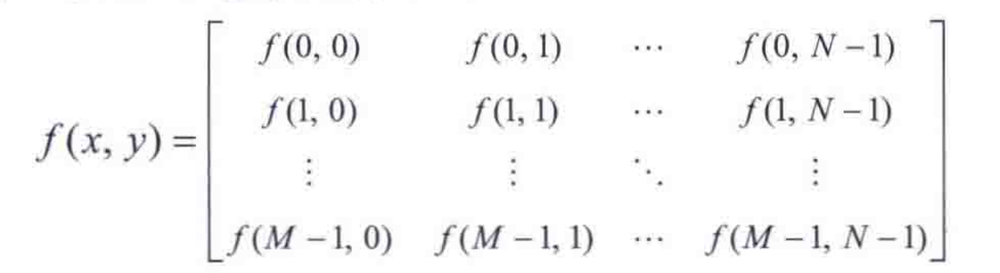
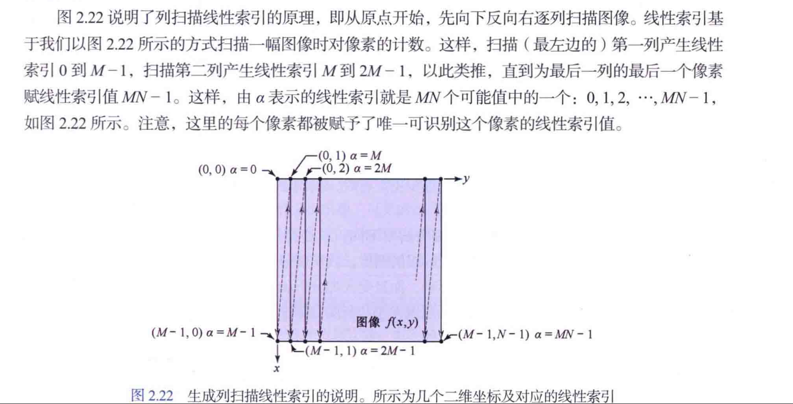

要产生一副数字图像，就需要把连续感测的数据转换成数字形式。这种转换包括两种处理：取样和量化。

一幅图像的$x$坐标和$y$坐标是连续的，其幅度也是连续的。对坐标值进行数字化称为取样（或采样），对幅度值进行数字化称为量化。

---

## 数字图像的表示
令$f(s,t)$表示一个由两个连续变量$s$和$t$的连续图像函数。
通过取样和量化，我们得到一副数字图像$f(x,y)$。
数字图像在原点位置的值就是$f(x,y)$。
对图像取样时，这些值并不是物理坐标值。
由图像的坐标张成的实平面部分称为空间域，$x$和$y$称为空间变量或空间坐标。

的三种方法.png)

将图像表示为由数值$f(x,y)$组成的一个阵列（矩阵），这是用于计算机处理的表示。

矩阵中的每个元素称为图像单元、图像元素或像素。特定像素是矩阵在一对固定坐标点处的值。我们通常用$f(x,y)$
来指坐标$(x,y)$处的像素值。

关于笛卡尔积，见https://zhuanlan.zhihu.com/p/265909030

数字图像化要求对M值、N值和离散灰度级数L进行判定。M、N必须取正整数，出于存储和量化硬件的考虑，通常L取为2的整数次幂。

灰度跨越的值域称为动态范围。（不同场合用法不同）本书中将图像系统的动态范围定义为系统中最大可度量灰度与最小可检测灰度之比。通常，上限取决于饱和度，下限取决于噪声。

图像对比度定义为一幅图像中最高和最低灰度级间的灰度差。反差比是这两个量的比率。

一幅图像具有2^k个可能的灰度级时，我们称该图像是一副“k比特图像”。

---

## 线性索引和坐标索引

一个像素的位置由其二维坐标给出，称为坐标索引或下标索引。

线性索引分为两种：基于图像的行扫描、基于图像的列扫描

给定坐标对$(x,y)$，对应的线性索引值：
$$α = My + x $$
给定先行索引值$α$,对应的坐标索引：
$$x = α % M $$
$$y = (a - x)/M$$

---

## 空间分辨率和灰度分辨率

空间分辨率是图像中最小可辨别细节的测度。单位距离的线对数和单位距离的点数（像素数）是最常用的测度。空间分辨率的测度必须针对空间单位来声明才有意义。图像大小本身并不含有空间分辨率信息。（不懂）

灰度分辨率是指在灰度级中可分辨的最小变换。

空间分辨率必须基于单位距离，灰度分辨率通常是指量化灰度时所用的比特数。比如一副灰度被量化成256级的图像，其灰度分辨率为8比特。灰度的可分辨变化不仅受噪声和饱和度值的影响，而且受人类分析和解释整个场景内容的感知能力的影响。

