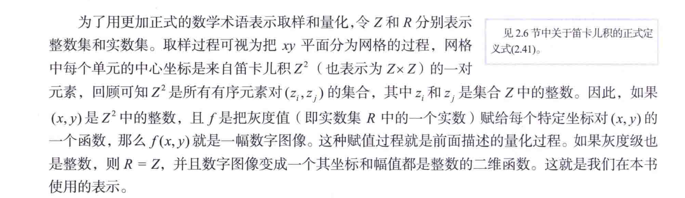

要产生一副数字图像，就需要把连续感测的数据转换成数字形式。这种转换包括两种处理：取样和量化。

一幅图像的$x$坐标和$y$坐标是连续的，其幅度也是连续的。对坐标值进行数字化称为取样（或采样），对幅度值进行数字化称为量化。

---

## 数字图像的表示
令$f(s,t)$表示一个由两个连续变量$s$和$t$的连续图像函数。
通过取样和量化，我们得到一副数字图像$f(x,y)$。
数字图像在原点位置的值就是$f(x,y)$。
对图像取样时，这些值并不是物理坐标值。
由图像的坐标张成的实平面部分称为空间域，$x$和$y$称为空间变量或空间坐标。

的三种方法.png)

将图像表示为由数值$f(x,y)$组成的一个阵列（矩阵），这是用于计算机处理的表示。

矩阵中的每个元素称为图像单元、图像元素或像素。特定像素是矩阵在一对固定坐标点处的值。我们通常用$f(x,y)$
来指坐标$(x,y)$处的像素值。

关于笛卡尔积，见https://zhuanlan.zhihu.com/p/265909030

